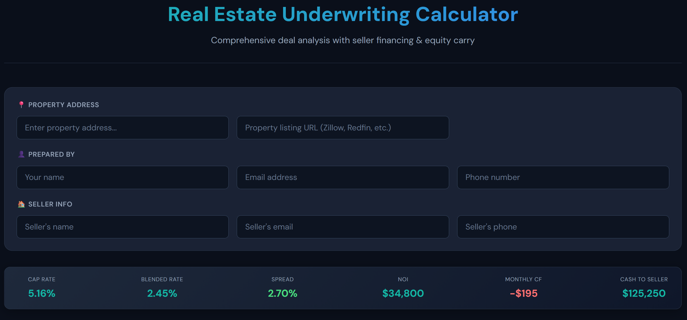

# equitycarrycalculator
A calculator to evaluate opportunities for the equity carry method
# Real Estate Underwriting Calculator for the Equity Carry Method

A comprehensive web-based tool for analyzing real estate investment deals with seller financing, equity carry, and balloon payment structures.

## 🔗 Live Demo

**[Try the Calculator →](https://your-demo-link.netlify.app)**

## Overview

This calculator was built to replace complex Excel-based underwriting spreadsheets with a modern, interactive web application. It's designed for real estate investors, wholesalers, and agents who need to quickly analyze deals involving creative financing structures.

## Features

### 📊 Deal Analysis
- Purchase price vs. asking price comparison
- Automatic interest rate and amortization based on property type
- Support for DSCR Residential, 12+ Unit Residential, Commercial, Mixed Use, and RV Parks

### 💰 Financing Structures
- First position loan calculations with interest-only option
- Seller carry/seller financing with customizable terms
- Adjustable LTV percentages and down payment calculations
- Balloon payment tracking and projections

### 📈 Cash Flow Analysis
- Net Operating Income (NOI) calculation
- Cap rate analysis
- Cash-on-Cash return
- Monthly and annual cash flow projections
- Operating expense tracking (taxes, insurance, CapEx, vacancy, management)

### 🎈 Equity & Balloon Projections
- Property value appreciation modeling
- Remaining loan balance calculations
- Equity position at balloon date
- Equity percentage projections

### 📄 PDF Export
- Professional one-page summary report
- Property address and preparer information
- Key metrics highlighted
- Print-ready formatting

## Tech Stack

- **HTML5** — Semantic markup
- **CSS3** — Custom properties, Grid, Flexbox, Print styles
- **Vanilla JavaScript** — No dependencies, runs anywhere
- **Google Fonts** — DM Sans & Space Mono

## Getting Started

### Option 1: Open Directly
Simply download `index.html` and open it in any modern browser. No server required.

### Option 2: Deploy to Netlify
1. Drag and drop the HTML file to [Netlify Drop](https://app.netlify.com/drop)
2. Get an instant shareable URL

### Option 3: GitHub Pages
1. Fork this repository
2. Go to Settings → Pages
3. Enable GitHub Pages from main branch
4. Access at `https://yourusername.github.io/repo-name`

## Usage

1. **Enter property details** — Address, purchase price, asking price, rental revenue
2. **Configure financing** — Set LTV percentages, seller carry terms, interest rates
3. **Add operating expenses** — Property tax, insurance, management fees, vacancy
4. **Review analysis** — Cash flow, NOI, cap rate, and returns update in real-time
5. **Export PDF** — Click the export button to generate a professional summary

## Calculations

The calculator replicates standard real estate financial formulas:

- **PMT (Payment)**: Standard amortization formula for loan payments
- **Cap Rate**: NOI ÷ Purchase Price
- **Cash-on-Cash**: Annual Cash Flow ÷ Total Cash Invested
- **Remaining Balance**: Amortization schedule calculation at balloon date
- **Future Value**: Purchase price × (1 + appreciation rate)^years

## Roadmap

- [ ] Save/load deal scenarios
- [ ] Multiple property comparison
- [ ] Sensitivity analysis tables
- [ ] Integration with property data APIs
- [ ] Mobile app version

## Contributing

Contributions are welcome! Feel free to open an issue or submit a pull request.

## License

MIT License — see [LICENSE](LICENSE) for details.

---

Built to solve real problems in real estate investing, by markarian.ai
